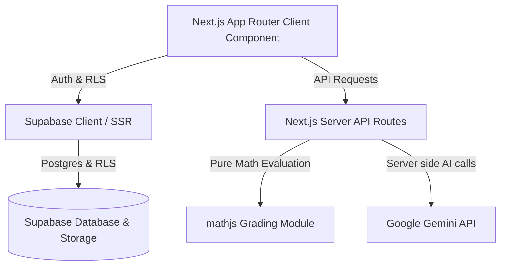

# MathLab System Architecture

### Kiến Trúc Bảo Mật & Đấu Nối
1. **Frontend**: Next.js 15 App Router với React Server Components (RSC) mặc định, Tailwind CSS & KaTeX render LaTeX.
2. **Backend**: Next.js Server Actions & API Route Handlers.
3. **Database**: Supabase Postgres với mã hóa RLS nâng cao và RPC `security definer`.
4. **Trợ lý AI**: Gemini API (model `gemini-2.5-flash`) truyền thông điệp dạng Streaming response.
